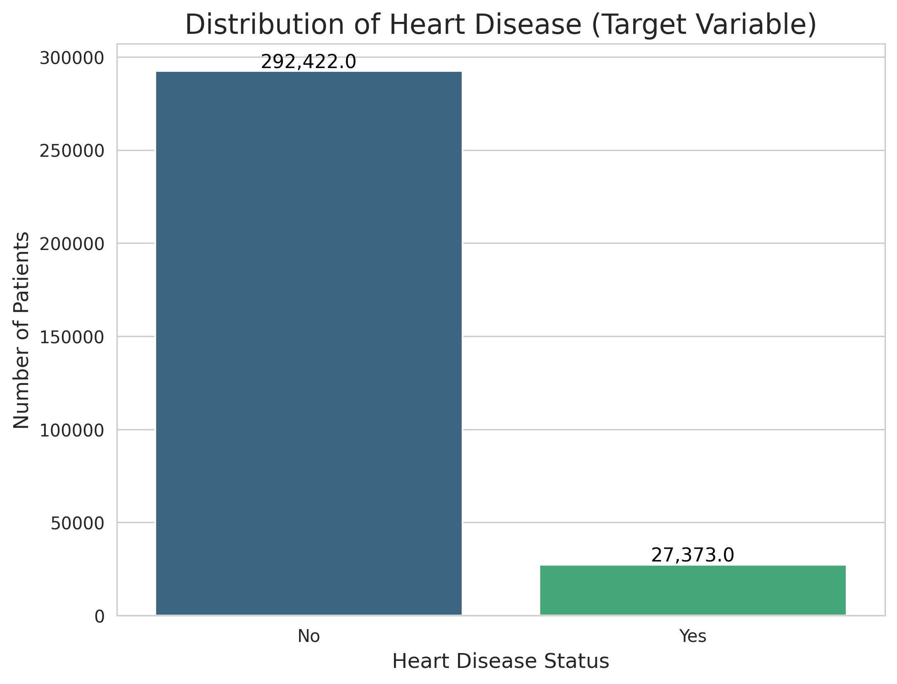
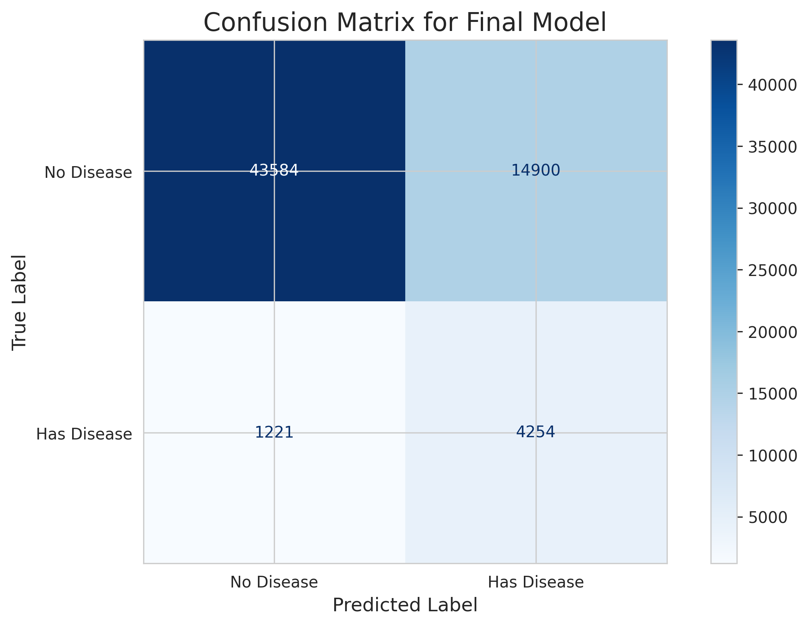
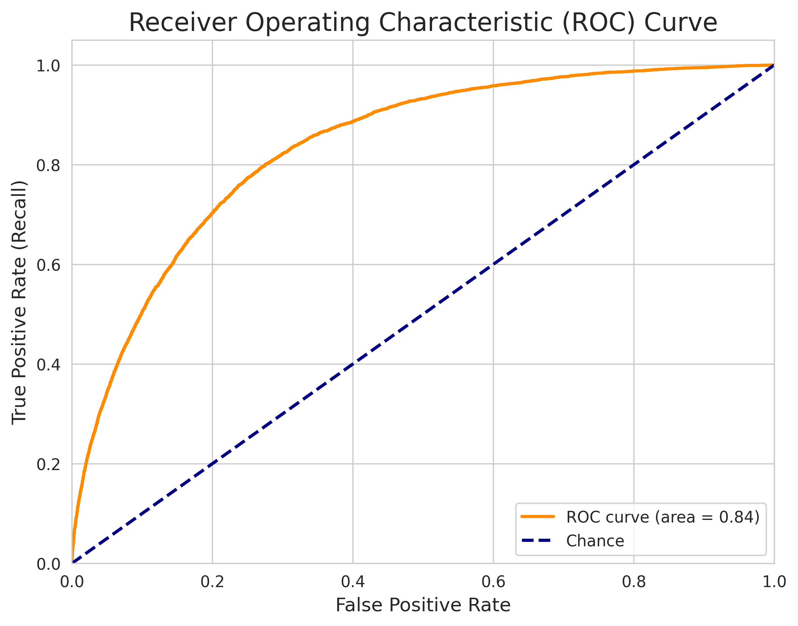
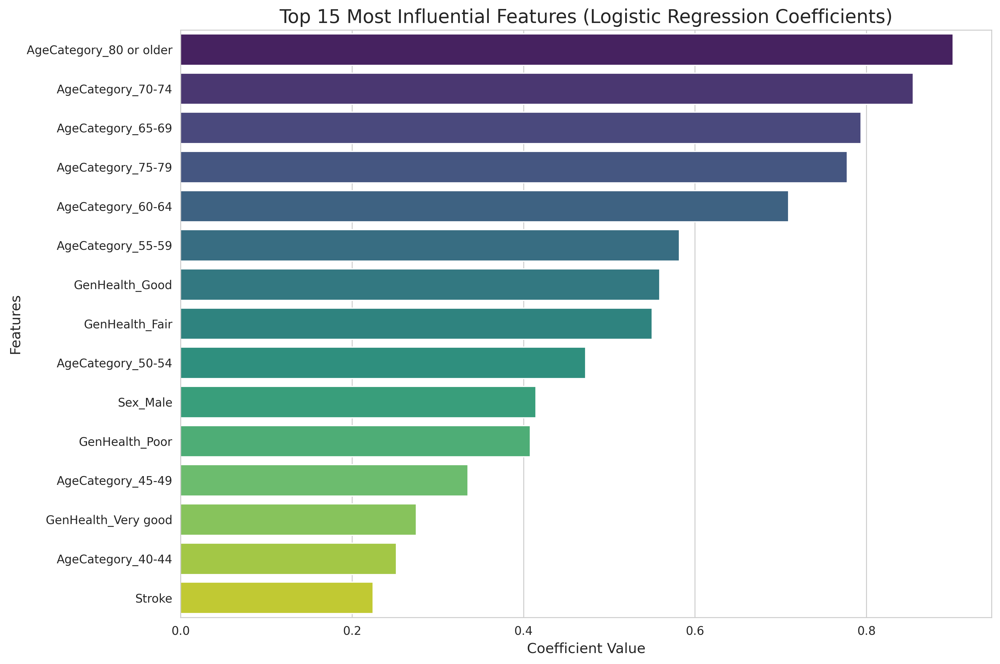

# ❤️ Heart Disease Prediction

A machine learning-powered web application designed to predict the risk of heart disease based on personal health indicators. This project focuses on optimizing for **Recall** to minimize missed diagnoses, a critical factor in preventative healthcare.

## 🌐 Live Demo

Experience the live application here: **[https://heart-disease-prediction-7.streamlit.app/](https://heart-disease-prediction-7.streamlit.app/)**

## 🛠 Tech Stack

- **Language:** Python
- **Machine Learning:** Scikit-learn, Pandas, NumPy
- **Data Visualization:** Matplotlib, Seaborn
- **Web Application:** Streamlit
- **Deployment:** Streamlit Cloud
- **Version Control:** Git, GitHub

## 📊 Project Walkthrough & Methodology

This project follows a structured machine learning pipeline to ensure a robust and reliable model.

### 1. Data Exploration (EDA)
- **Dataset:** CDC's 2020 BRFSS Personal Key Indicators of Heart Disease.
- **Analysis:** Conducted a thorough exploration to understand feature distributions and identify a severe class imbalance (91% No Disease, 9% Has Disease).
- **Visualization:** Created multiple plots to visualize the relationship between key features and heart disease.



### 2. Data Preprocessing
- **Encoding:** Converted binary features ('Yes'/'No') to 1/0 and applied one-hot encoding to multi-class categorical features.
- **Splitting:** Split the data into 80% training and 20% testing sets, using stratification to maintain the class imbalance in both sets.
- **Scaling:** Used `StandardScaler` to scale numerical features for optimal model performance.

### 3. Model Training & Comparison
- **Models Trained:** Trained and compared 6 different classification models, including Logistic Regression, Random Forest, Gradient Boosting.
- **Key Finding:** Logistic Regression, when configured with `class_weight='balanced'`, provided the highest **Recall** score, making it the best choice for this project's goal.

### 4. Model Optimization & Evaluation
- **Hyperparameter Tuning:** Used `RandomizedSearchCV` to fine-tune the Logistic Regression model, optimizing for the Recall metric.
- **Final Metrics:**
  - **Accuracy:** 74.89%
  - **Recall:** 77.48%
  - **Precision:** 22.24%
  - **F1-Score:** 34.56%

The model successfully prioritized minimizing false negatives (missed diagnoses) over overall accuracy.

#### Confusion Matrix


#### ROC Curve


### 5. Feature Importance
- **Analysis:** Analyzed the model's coefficients to identify the most influential features.
- **Key Predictors:** `AgeCategory_80 or older`, `GenHealth_Poor`, and `Stroke` were among the strongest predictors of heart disease, providing clinical interpretability.



### 6. Deployment
- **Model Saving:** Saved the final trained model, scaler, and column order using `pickle`.
- **App Development:** Built an interactive web application using Streamlit that allows users to input their health data and receive a risk prediction.
- **Local Testing:** The application was successfully tested and runs locally.

## 🚀 How to Run Locally

To run this application locally, follow these steps:

1.  **Clone the repository:**
    ```bash
    git clone https://github.com/aryan578765/Heart-Disease-Prediction.git
    ```
2.  **Navigate to the project directory:**
    ```bash
    cd Heart-Disease-Prediction
    ```
3.  **Install the required packages:**
    ```bash
    pip install -r requirements.txt
    ```
4.  **Run the Streamlit app:**
    ```bash
    streamlit run app.py
    ```
5.  Open your web browser and go to `http://localhost:8501`.

## 📈 Future Work

- **Advanced Imbalance Handling:** Experiment with more advanced techniques like SMOTE or ADASYN to see if Recall can be further improved.
- **Model Ensembling:** Combine multiple models to potentially improve overall performance.
- **Enhanced UI/UX:** Add more interactive elements and detailed explanations for users.

## 🙏 Acknowledgments

- The dataset used in this project is sourced from the [CDC's Behavioral Risk Factor Surveillance System (BRFSS)](https://www.kaggle.com/datasets/kamilpytlak/personal-key-indicators-of-heart-disease) and made available on Kaggle by Kamil Pytlak.
